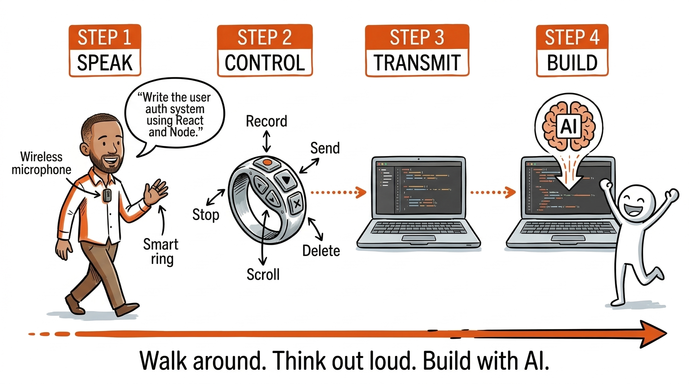

# Voice AI



**Walk around. Think out loud. Build with AI.**

A monorepo with two independent tools for hands-free AI coding. Use one or both - they work together but neither requires the other.

## Components

### [ring-bridge](ring-bridge/) - Smart Ring Controller

A macOS daemon that turns a ~$15 Bluetooth smart ring (JX-11) into a wireless controller for AI coding agents like [Claude Code](https://claude.com/claude-code) and [Codex](https://openai.com/codex).

**What you get**: Walk around your house or co-working space and control your AI agent with ring gestures - tap to record voice, swipe to send/delete, scroll to read output, press to interrupt.

**You need**: A JX-11 ring, a wireless microphone, and a Mac.

```bash
cd ring-bridge
make install
```

[Full setup guide &rarr;](ring-bridge/README.md)

### [riff](riff/) - Voice Narrator for AI Agents

A macOS daemon that speaks your AI agent's output aloud using on-device TTS (Kokoro via MLX on Apple Silicon). No API keys, no cloud, no latency.

**What you get**: Walk away from your desk and hear what your agents are doing - task starts, completions, errors, summaries - spoken aloud through your Mac's speakers or headphones.

**You need**: A Mac with Apple Silicon (M1+).

```bash
cd riff
make install
```

[Full setup guide &rarr;](riff/README.md)

## Use Them Together or Separately

| Setup | What you can do |
|---|---|
| **ring-bridge only** | Control AI agents by voice + ring gestures. Read output on screen. |
| **riff only** | Type at your desk as normal. Hear agent output spoken aloud. |
| **Both** | Full hands-free loop: speak instructions via ring, hear responses via riff. Walk around and build. |

Most people start with **ring-bridge** - it's the core "walk around and code" experience. Add **riff** later if you want audio feedback without looking at the screen.

## Hardware

| Item | Cost | Where to get it |
|---|---|---|
| JX-11 Smart Ring | ~$15 | AliExpress, Amazon |
| Wireless microphone | $30-300 | DJI Mic, Rode Wireless Go, or any BT/wireless mic |
| Voice-to-text app | Free-$10 | [FluidVoice](https://fluidvoice.ai/), [Superwhisper](https://superwhisper.com/), [Whisper Flow](https://whisperflow.com/), [Handy](https://handyai.app/) |

## Requirements

- macOS (tested on macOS 15 Sequoia)
- Apple Silicon (M1+) required for riff (ring-bridge works on Intel too)
- An AI coding agent that runs in the terminal (Claude Code, Codex, Aider, etc.)

## Licence

MIT
