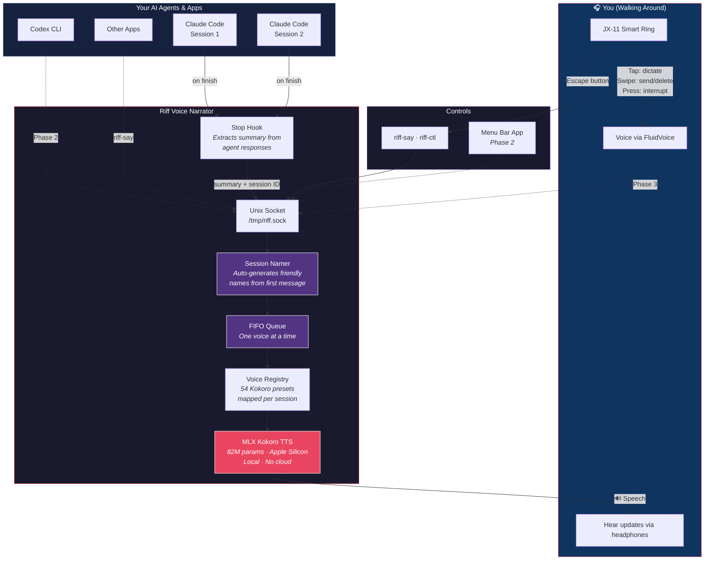

# Riff Architecture

## The Flow

1. **Your AI agents work** - Claude Code, Codex, or any app finishes a task
2. **Hook captures the output** - extracts a spoken summary from the response
3. **Riff receives it** - via Unix socket, queues it (one voice at a time)
4. **Session is identified** - auto-named from content or labelled by the agent
5. **Voice is selected** - each session gets its own Kokoro voice preset
6. **You hear it** - MLX Kokoro speaks through your headphones, locally on Apple Silicon
7. **You interact** - ring to interrupt, voice to respond (Phase 3)
